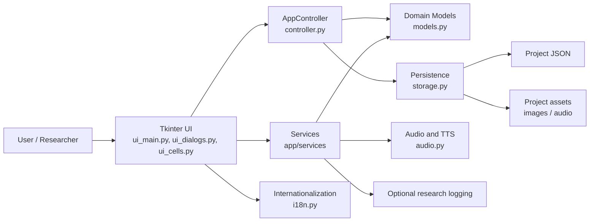
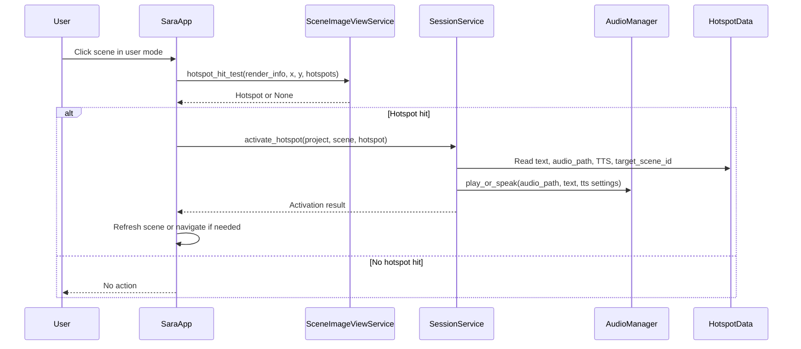
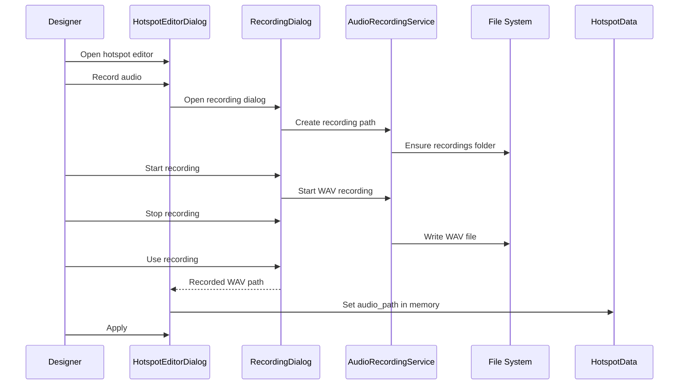
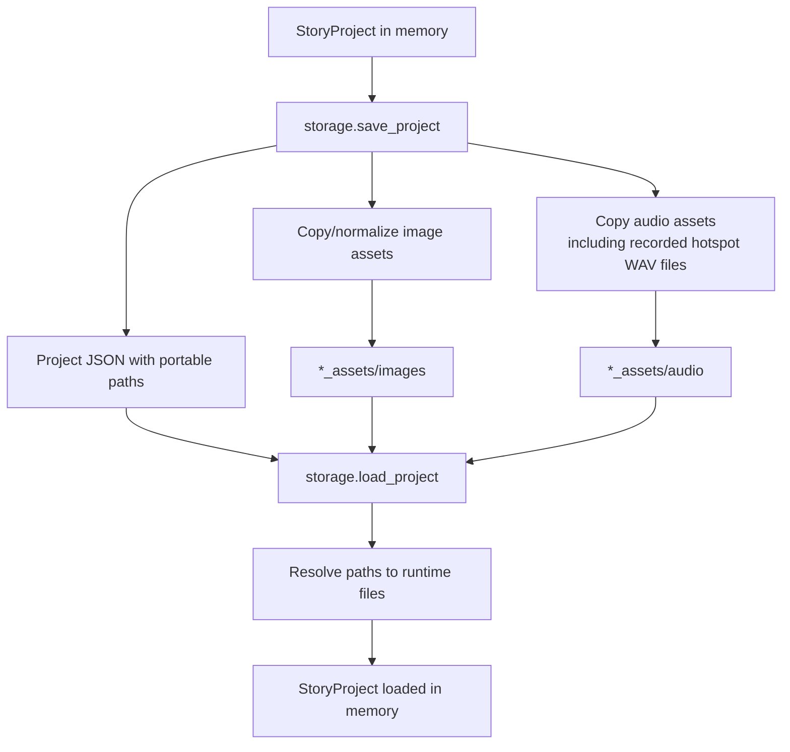

# Sara Architecture

Version: Sara 0.1.26

This document describes the current software architecture of Sara as implemented in the codebase. It is intended for technical maintenance, reproducibility, and as a basis for a future "Implementation and architecture" section in a SoftwareX article.

## 1. Overview

Sara is a desktop application for creating and running interactive visual scene displays. A project is composed of visual scenes. Each scene may contain a background image, interactive hotspots, visual support cells, optional scene-level audio, and optional research logging metadata.

The application is implemented in Python with Tkinter for the desktop interface. Project data are stored as JSON, while associated assets such as images and audio files are stored alongside the project in asset folders. Sara supports two runtime modes: a design mode for authoring/editing scenes and a user mode for interaction. The interface is internationalized in English and Spanish.

The current architecture is intentionally conservative: a central Tkinter application class orchestrates UI events, services implement focused workflow or rendering operations, model classes define the project data structure, and storage utilities serialize/deserialize projects and assets.

## 2. Architectural Layers

Sara can be understood as a layered desktop application:

1. Presentation layer
   - Tkinter main window, dialogs, widgets, menus, toolbars, and event bindings.
   - Main files: `app/ui_main.py`, `app/ui_dialogs.py`, `app/ui_cells.py`.

2. Application/controller layer
   - Coordinates project state, current scene, runtime mode, support activation, hotspot activation, and workflow operations.
   - Main file: `app/controller.py`.

3. Service layer
   - Focused services for scene rendering, hotspot geometry, support state, dialogs, settings, research workflows, audio recording, image handling, and UI state updates.
   - Main folder: `app/services/`.

4. Domain model layer
   - Dataclasses representing projects, scenes, hotspots, supports, text styles, and research settings.
   - Main file: `app/models.py`.

5. Persistence and asset layer
   - JSON save/load plus asset copying, relative path handling, and runtime path resolution.
   - Main file: `app/storage.py`.

6. Runtime integration layer
   - Audio playback, TTS, recorded audio capture, internationalization, optional research logging, and local settings.
   - Main files: `app/audio.py`, `app/i18n.py`, `app/research.py`, `app/research_support.py`, `app/services/audio_recording_service.py`, `app/services/settings_service.py`.

7. Quality control layer
   - Pytest-based tests covering persistence, hotspots, support logic, mode logic, scene navigation, i18n, recorded audio workflows, storage behavior, and selected Tkinter runtime safety checks.
   - Main folder: `tests/`.

## 3. Main Modules and Responsibilities

### `app/ui_main.py`

`ui_main.py` contains the main `SaraApp` class. It builds the main Tkinter layout, manages scene navigation, switches between design and user modes, renders the current scene, coordinates the visual support strip, handles hotspot events, exposes the scene audio button behavior, and integrates research controls.

Responsibilities include:

- Building the main window layout and menu structure.
- Switching between design and user modes.
- Navigating, adding, duplicating, moving, renaming, and deleting scenes.
- Rendering the scene image and overlaying hotspots through `SceneImageViewService`.
- Handling hotspot creation, selection, dragging, resizing, deletion, and activation.
- Coordinating support strip visibility and rendering.
- Delegating audio, research, project, and dialog actions to services.

### `app/ui_dialogs.py`

`ui_dialogs.py` defines application dialogs, including scene editing, hotspot editing, support/cell editing, research-related dialogs, and the recorded hotspot audio dialog. The hotspot editor includes the `Research: Communication category` section for selecting one generic communication category per hotspot.

Responsibilities include:

- Displaying editable forms for scenes, hotspots, and support cells.
- Selecting or clearing audio files.
- Recording hotspot audio through `audio_recording_service`.
- Applying dialog changes to model objects in memory.
- Presenting localized labels and button text through `app/i18n.py`.

### `app/ui_cells.py`

`ui_cells.py` implements the support/cell widget used for visual supports.

Responsibilities include:

- Displaying support text and images.
- Managing Tkinter `PhotoImage` references safely.
- Scheduling and cancelling deferred rendering callbacks.
- Clearing and reconfiguring support cells without leaking stale image state.

### `app/models.py`

`models.py` defines the data model used by the application and persisted to JSON.

Core model objects include:

- `StoryProject`: top-level project container.
- `Scene`: scene image, title, hotspots, supports, and scene audio.
- `HotspotData`: normalized geometry, label, visibility, style, audio path, TTS behavior, optional target scene, and generic communication-category metadata.
- `CellData`: visual support content, image, audio, visibility, position, and metadata.
- `ResearchSettings`: optional research/logging configuration.

Hotspot communication categories are centralized in `app/vocabulary_categories.py`. They are defined by Sara as a generic communication/vocabulary metadata classification, not as a diagnostic or clinical assessment taxonomy. The UI presents the categories in three compact columns for usability, while the internal model preserves the category identifier, label, and analysis group.

These classes form the compatibility boundary for project files.

### `app/controller.py`

`controller.py` provides the `AppController`, which owns the active `StoryProject`, current scene index, and mode-related state.

Responsibilities include:

- Returning the current scene and project.
- Updating and retrieving visual supports per scene.
- Activating supports and hotspots.
- Managing scene-level project operations in coordination with workflow services.

### `app/storage.py`

`storage.py` serializes and deserializes projects.

Responsibilities include:

- Saving `StoryProject` data as JSON.
- Loading JSON into model objects.
- Copying external assets into project asset folders.
- Storing portable relative paths in JSON when possible.
- Resolving relative paths back into usable runtime paths on load.
- Preserving compatibility with existing project files.

### `app/audio.py`

`audio.py` provides audio playback and TTS support.

Responsibilities include:

- Playing audio files associated with scenes, hotspots, and supports.
- Prioritizing explicit audio files over TTS when both are available.
- Falling back across available playback/TTS mechanisms where needed.
- Keeping platform-specific playback concerns outside the UI event code.

### `app/i18n.py`

`i18n.py` provides translation keys and runtime language selection.

Responsibilities include:

- Maintaining English and Spanish UI strings.
- Providing the `tr()` function used throughout the UI.
- Defining localized menu labels, dialog text, messages, and About text.

### `app/services/`

The services folder contains focused modules that reduce direct responsibility in the main UI:

- `scene_image_view_service.py`: scene image loading, scaling, render information, and hotspot overlays.
- `hotspot_geometry_service.py`: pure hotspot geometry operations and hit testing.
- `support_state_service.py`: pure support visibility/content counting logic.
- `audio_recording_service.py`: generated recording paths, recording directory handling, and WAV recording support.
- `scene_workflow_service.py`: scene workflow operations.
- `project_workflow_service.py`: project open/save/new workflow operations.
- `research_workflow_service.py`: research toggle and configuration workflows.
- `session_service.py`: user-mode activation behavior and research context synchronization.
- `ui_state_service.py`: UI state updates such as navigation button states.
- `../vocabulary_categories.py`: centralized generic Sara communication-category definitions used by the hotspot editor, JSON persistence, and research logs.
- Other services provide image handling, ARASAAC lookup, Fitzgerald color support, settings, dialogs, text output, and lifecycle helpers.

## 4. Domain Model

The project model is scene-centered.

A `StoryProject` contains:

- Project metadata.
- A list of `Scene` objects.
- Optional research settings.
- Optional project-level configuration.

A `Scene` contains:

- A visible title.
- An optional scene image path.
- An optional scene audio path.
- A list of `HotspotData` objects.
- A fixed or normalized set of visual support `CellData` objects.

A `HotspotData` contains:

- A stable identifier.
- Normalized geometry: `x`, `y`, `width`, and `height`.
- Optional visible label text.
- Optional inserted/output text.
- Optional audio path.
- Optional TTS behavior.
- Optional target scene id for navigation.
- Visibility and style properties.
- Optional communication-category metadata fields: `vocabulary_category_id`, `vocabulary_category_label`, and `vocabulary_category_group`.

A `CellData` support contains:

- Optional text.
- Optional image path.
- Optional audio path.
- Visibility and position metadata.

The JSON format is a public compatibility surface. Changes to model fields should therefore be treated as migration-sensitive.

## 5. Runtime Modes

Sara has two main runtime modes.

### Design mode

Design mode is used to author and configure projects. It enables:

- Scene editing.
- Hotspot creation, selection, dragging, resizing, editing, and deletion.
- Support editing and visibility configuration.
- Scene audio configuration and testing.
- Research configuration.
- Project save/load workflows.

### User mode

User mode is used for interaction with an authored project. It limits editing controls and focuses on activation behavior:

- Clicking a hotspot activates its output behavior.
- Clicking outside a hotspot does not trigger scene audio.
- Scene audio is available only through the explicit scene audio button when the scene has audio.
- Editing controls are hidden or disabled.
- Hotspot label timers and output behavior are managed through UI state and session services.

The mode switch is coordinated by `SaraApp.set_mode()` and related visibility/update functions in `ui_main.py`.

## 6. Hotspots and Visual Supports

### Hotspots

Hotspots are interactive rectangular regions over a scene image. Their geometry is stored in normalized coordinates so that projects remain independent of display size. Runtime conversion between normalized and pixel coordinates is handled by `hotspot_geometry_service.py` and exposed through wrappers in `SceneImageViewService`.

Hotspot rendering is handled by `SceneImageViewService._overlay_hotspots()`, while event handling remains in `SaraApp`:

- `_on_scene_click()` starts selection, creation, movement, resizing, or user-mode activation depending on mode and tool state.
- `_on_scene_drag()` updates move/resize/create preview state.
- `_on_scene_release()` commits or clears drag state.
- `activate_hotspot()` delegates activation behavior to session/audio services.

### Visual supports

Visual supports are per-scene cells shown in a support strip. They can include text, image, audio, visibility, position, and metadata. Support state is owned by the current scene, not by a global support object.

Key safeguards include:

- Persistence tests confirm supports remain scene-specific.
- `support_state_service.py` centralizes pure content/visibility checks.
- `ui_cells.py` manages `PhotoImage` lifecycle and deferred rendering safely.
- Support strip visibility is controlled by UI state and must remain consistent across scene navigation.

## 7. Audio, TTS, and Recorded Hotspot Audio

Sara supports several audio paths:

1. Scene audio
   - Associated with `Scene.scene_audio`.
   - Played through an explicit scene audio button.
   - In design mode, the button is visible for configuration/testing.
   - In user mode, the button is visible only if scene audio exists.

2. Hotspot audio
   - Stored in `HotspotData.audio_path`.
   - Played when a hotspot is activated.
   - Takes priority over TTS when an audio file exists.

3. Support audio
   - Stored in support/cell data and activated through support behavior.

4. TTS
   - Used when configured and when explicit audio is not available.
   - Managed by `AudioManager` and session activation logic.

5. Recorded hotspot audio
   - Created through the recording dialog in `ui_dialogs.py`.
   - Recording path and WAV capture are handled by `app/services/audio_recording_service.py`.
   - Temporary recordings can be created under `sarab_data/audio/recordings`.
   - On save, storage copies referenced audio into project asset folders and persists portable paths.

The audio architecture separates user interaction from recording/path generation and playback backends. This reduces the risk of UI changes breaking storage or playback behavior.

## 8. Persistence Model: JSON and Assets

Sara stores projects as JSON plus asset folders.

A project JSON file stores structured project data: scenes, supports, hotspots, audio references, research settings, vocabulary category metadata, and configuration. Asset files are stored outside the JSON in project-specific folders, commonly following a `*_assets/` convention.

Typical asset structure:

- `project.json`
- `project_assets/images/`
- `project_assets/audio/`

Persistence responsibilities include:

- Copying external images/audio into the project asset folder.
- Preserving existing project files.
- Saving portable relative asset paths in JSON where possible.
- Persisting hotspot communication-category metadata fields with each hotspot when selected.
- Resolving relative paths to absolute runtime paths when loading.
- Keeping recorded hotspot audio playable after save/load cycles.

This model supports scientific reproducibility because the JSON and its asset folder can be archived together as a complete project package.

## 9. Internationalization

Sara uses `app/i18n.py` for runtime translation. The default interface language is English, and Spanish remains available.

Internationalization responsibilities include:

- Menu labels.
- Main window controls.
- Dialog labels and buttons.
- Tooltips and messages where translated.
- About text.
- Hotspot editor and recorded audio dialog text.
- The `Research: Communication category` section and communication category labels.

The current architecture supports adding further languages by extending translation dictionaries and replacing remaining hardcoded strings with translation keys.

## 10. Optional Research Logging

Sara includes optional research/logging functionality for studies and structured observation.

Research-related behavior is separated from the core scene/hotspot functionality:

- Research state and configuration live in research modules/settings.
- Research workflow operations are delegated through `research_workflow_service.py`.
- Runtime context synchronization is coordinated by `session_service.py` and UI bridge methods.
- Hotspot research events use `vocabulary_category_id`, `vocabulary_category_label`, and `vocabulary_category_group` as the active hotspot vocabulary-category fields.
- Session summaries can aggregate communication-category activity through `category_counts`, `communication_category_count`, and `top_vocabulary_categories`.
- Tests cover basic expected logging behavior and help prevent duplicate event recording.

Research logging should be treated as privacy-sensitive. Publications or deployments should document what is logged, where logs are stored, and how users/participants are identified or anonymized.

## 11. Testing and Quality Control

Sara has a growing pytest suite used as a safety net for maintenance and packaging.

Current test areas include:

- Project persistence round trips.
- Scene-specific support persistence.
- Anti-mojibake text quality checks.
- Hotspot geometry and hit testing.
- Scene image loading and hotspot overlays.
- Tkinter cell widget runtime safety, including `PhotoImage` lifecycle and deferred callbacks.
- Controller support behavior.
- Support strip state and synchronization.
- Scene navigation behavior.
- Hotspot creation, selection, drag, resize, deletion, activation, user clicks, and label timers.
- Mode switching and visibility behavior.
- Research UI delegation behavior.
- Launcher and version checks.
- Recorded hotspot audio path generation, dialog behavior, persistence, and activation flow.
- Generic communication-category definitions, hotspot JSON fields, and research log columns.

The tests intentionally use fakes/spies where possible to avoid launching the full application or requiring real audio devices. Manual validation remains important for Tkinter layout, actual audio recording/playback, microphone permissions, and packaged executable behavior.

## 12. Main Data Flows

### Creating a Scene

1. The user invokes a scene creation command in design mode.
2. `SaraApp` delegates scene creation to controller/workflow logic.
3. A new `Scene` object is added to the current `StoryProject`.
4. The current scene index is updated.
5. UI refresh functions update the scene view, navigation controls, thumbnails, supports, and mode-specific controls.
6. The project remains in memory until explicitly saved.

### Creating or Editing a Hotspot

1. In design mode, the user selects the hotspot creation or selection tool.
2. Pointer events over the scene image are converted into local image coordinates.
3. Geometry helpers convert between pixel and normalized coordinates.
4. A `HotspotData` object is created or updated.
5. `HotspotEditorDialog` edits label, text, audio, TTS, style, visibility, target scene, timing fields, and one generic communication category.
6. Applying the dialog updates the in-memory hotspot, including `vocabulary_category_id`, `vocabulary_category_label`, and `vocabulary_category_group` when a category is selected.
7. The scene image is rerendered with the updated hotspot overlay.

### Recording Hotspot Audio

1. The user opens the hotspot editor in design mode.
2. The user opens the recorded audio dialog from the hotspot audio section.
3. `audio_recording_service.py` generates a safe WAV filename and recording destination.
4. The recording dialog starts and stops recording through `sounddevice` and WAV writing support.
5. The user can preview the recording.
6. Choosing "Use recording" assigns the resulting WAV path to `HotspotData.audio_path` in memory.
7. The main hotspot editor still requires Apply to keep the edited hotspot state.
8. The project is not saved automatically; explicit project save is still required.

### Saving and Loading Projects

1. The user saves a project through the project workflow.
2. `storage.py` serializes the `StoryProject` to JSON.
3. Referenced assets are copied into project asset folders when needed.
4. Audio paths and image paths are stored in a portable form where possible.
5. On load, JSON data are converted back into model objects.
6. Relative asset references are resolved to runtime paths.
7. The UI refreshes to display the loaded project state.

### Activating a Hotspot

1. In user mode, the user clicks on the scene image.
2. Hit testing checks whether the click is over a visible hotspot.
3. If no hotspot is hit, no scene audio is played automatically.
4. If a hotspot is hit, `SaraApp.activate_hotspot()` delegates to session activation logic.
5. If the hotspot has audio, `AudioManager.play_or_speak()` plays the audio file.
6. If no audio is available and TTS is enabled, TTS may be used.
7. If the hotspot targets another scene, the current scene index changes and the UI refreshes.
8. Research context/text output may be synchronized when research logging is enabled.

## 13. Suggested Diagrams

### General Architecture

### Hotspot Activation Workflow

### Recorded Audio Workflow

### JSON and Assets Persistence Workflow

## 14. Current Architectural Risks and Safeguards

### Risks

- `ui_main.py` remains a large orchestration module with many Tkinter callbacks and shared UI state.
- `ui_dialogs.py` contains several different dialog responsibilities, including hotspot editing and recorded audio capture.
- The model and JSON format are compatibility-sensitive; field changes require careful migration planning.
- Tkinter rendering and callback timing can be fragile, especially around image lifetimes, resize events, and deferred callbacks.
- Audio recording and playback depend on platform-specific runtime conditions such as microphone permissions, Windows input configuration, and available playback/TTS backends.
- Research logging may contain sensitive interaction/session data and requires privacy documentation before study deployment.
- Some automated tests use fakes and spies; full packaged-executable behavior still requires manual validation.
- Asset path portability depends on storage maintaining correct relative paths and asset copying behavior.

### Safeguards

- Broad pytest coverage protects persistence, controller logic, hotspots, support state, recorded audio workflows, mode changes, and selected Tkinter runtime behavior.
- Geometry and support-state logic have been extracted into pure services where tests can run without the full GUI.
- Storage behavior is covered by round-trip tests, including recorded hotspot audio persistence.
- `PhotoImage` lifecycle and deferred support-cell rendering are covered by runtime tests.
- User-mode hotspot behavior prevents accidental scene audio playback when clicking outside hotspots.
- The explicit scene audio button policy is covered by tests.

## 15. Extension Points

Potential extension points include:

- Additional languages by extending `app/i18n.py` and replacing remaining hardcoded strings.
- New audio backends or recording options behind `audio.py` and `audio_recording_service.py`.
- Alternative research exporters or anonymization layers in the research service modules.
- Additional scene templates and reusable project examples under `sarab_data/projects`.
- More formal project migrations if the JSON schema evolves.
- A future split of `ui_main.py` into smaller UI controllers once tests fully cover the visual orchestration layer.
- A dedicated package/build layer for reproducible EXE generation and scientific release artifacts.
- Additional automated checks for documentation, asset completeness, and packaged runtime behavior.

For publication-oriented documentation, the recommended next artifact is a short architecture figure based on the Mermaid diagrams above, followed by a SoftwareX-oriented implementation description that emphasizes the separation between authoring mode, user interaction mode, JSON/assets persistence, optional research logging, and recorded audio support.
